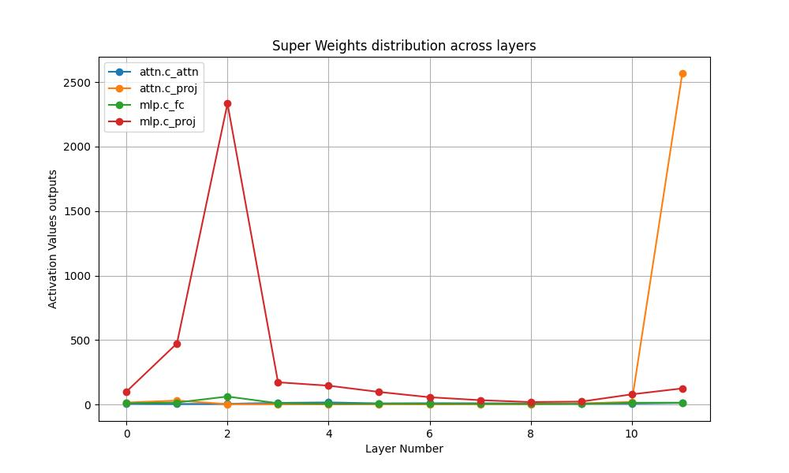

# LLM-fine-tuning
## Motivation
Full fine-tuning of Large Language Models is the process of turning general-purpose model into specialized one while updating all pre-trained model weights over a downstream task dataset. Full fine-tuning is exceedingly resource-intensive, that is why various fine-tuning acceleration strategies are utilized, allowing for reduction of training time and memory costs, while maintaining the quality. There are exist different approaches to fine-tuning acceleration. Among them, Parameter-Efficient Fine-Tuning (PEFT) considered as the most prominent approach, which updates only a small fraction of the model parameters, substantially reducing the computational and storage costs while maintaining the accuracy. At the same time, there are works postulating the existence of a small fraction of extremely important [Super Weights inside LLM](https://arxiv.org/abs/2411.07191), removing of which can lead to substantial quality degradation. This project aims at training only layers containing these Super Weights to further accelerate LoRA-based fine-tuning while maintaining the quality.

## Prerequisites
- Model: [GPT2](https://huggingface.co/openai-community/gpt2);
- Dataset: [E2E-NLG](https://huggingface.co/datasets/tuetschek/e2e_nlg) - dataset for training end-to-end, data-driven natural language generation systems in the restaurant domain;
- Baseline: [LoRA](https://arxiv.org/abs/2106.09685)-based fine-tuning;

## Setup
1. Create virtual environment
```bash
    python3.11 -m venv venv
    source venv/bin/activate
```
2. Install project dependencies
```bash
    pip install -r requirements.txt
```

## Run training and evaluation pipeline 
### Arguments 
* `path_to_model` - path to local or HuggingFace model
* `path_to_tokenizer` - path to local or HuggingFace tokenizer
* `path_to_peft_model` - path to checkpoint with fine-tuned PEFT model
* `path_to_dataset` - path to local or HuggingFace dataset
* `lora_rank` - rank for LoRA adapters
* `lora_alpha` - LoRA alpha hyperparameter 
* `lora_dropout` - LoRA dropout ratio
* `lora_target_modules` - LLM modules to apply LoRA adapters
* `lora_layers_to_transform` - LLM layers numbers to apply LoRA adapters
* `validation_batch_size` - batch size for validation pipeline

### Run training
```python
cd train_eval_pipeline
python -m main --mode "train"
```

### Run evaluation
```python
cd train_eval_pipeline
python -m main --mode "eval"
```

### Run training with following evaluation
```python
cd train_eval_pipeline
python -m main --mode "train_eval"
```

## Run Super Weights identification 

Code for Super Weights identification is based on the official [repository](https://github.com/mengxiayu/LLMSuperWeight). 

### Arguments 
* `--path_to_model` - path to your model, by default: `openai-community/gpt2`
* `--path_to_tokenizer` - path to model tokenizer, by default: `openai-community/gpt2`

For the GPT2 model the following Super Weight were identified: 


The greatest activations occur in the `mlp.c_proj` module of 2 layer and `attn.c_proj` module of 11 layer. Therefore, only these layers were chosen for the following LoRA-based fine-tuning.

### Run
```python
cd super_weights_identification
python -m main
```

## Run web application 
A website utilizing a LLM for text generation is highly relevant in today’s digital landscape, as it can significantly enhance content creation, user engagement, and efficiency. Such a platform can automatically produce high-quality, contextually relevant text for a variety of applications, including marketing copy, blog posts, product descriptions, and customer support responses. This not only saves time and resources for businesses but also improves the overall user experience by providing instant, informative, and engaging content.

To start the inference server, run the following command:
```bash
python -m web_site.main
```

(For inference aims a pretrained GPT2 model was used 
to avoid uploading heavy files with the fine-tuned model to GitHub)

## Results 

**Important:** results for some of these methods are not reported in the article for the GPT2 model, that is why I wrote here my results, when reproducing these methods with PEFT. All methods were used with the same hyperparameters.

| Method  |  Acceleration, % | Quality |
|:-:|:-:|:-:|
| [LoRA](https://arxiv.org/abs/2106.09685) (baseline)  | --  | 68.4  |
| Current Solution  | **25.47**  | 66.85 |
| [LoRA+](https://arxiv.org/abs/2402.12354) | 0 | **69.59** |
| [DoRA](https://arxiv.org/abs/2402.09353) | -36 | 68.22 |
| [AdaLoRA](https://arxiv.org/abs/2303.10512) | -11 | 69.31 |
| [PiSSA](https://arxiv.org/abs/2404.02948) | 0 | 67.47 |

**Conclusion:** proposed method of the LoRA-based fine-tuning of layers, containing Super Weights, provided decent results, accelerating fine-tuning by **25%** with a slight decrease in quality of **2.3%** compared to LoRA. 
